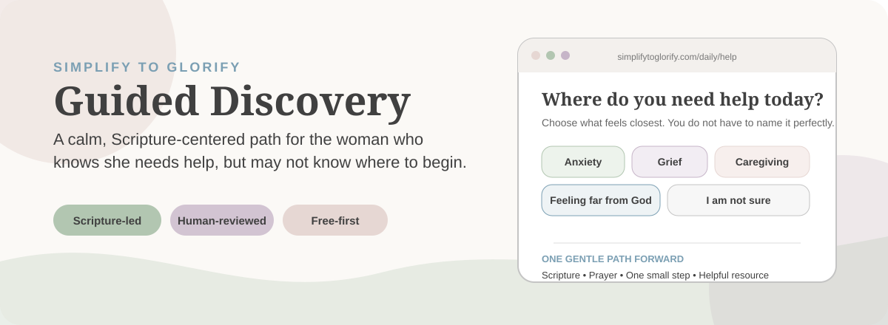
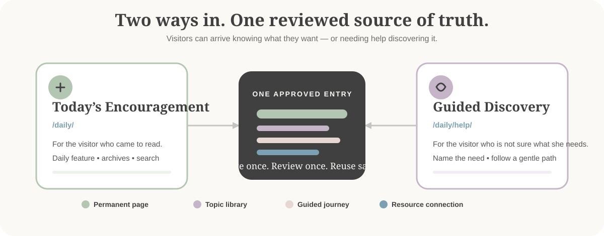
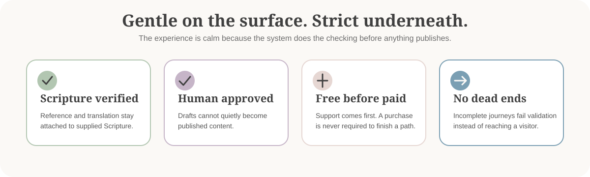

<p align="center">
  
</p>

# STG Guided Discovery

**A calm, Scripture-centered content system for [Simplify to Glorify](https://simplifytoglorify.com).**

One approved content entry can become a permanent page, a daily feature, a topic-library entry, and part of a guided journey — without creating four separate versions of the same message.

> **In plain English:** this is the part of Simplify to Glorify designed for the woman who arrives thinking, *“I know I need something, but I do not know what I need.”* Guided Discovery helps her name what she is carrying and gently connects her with appropriate Scripture-centered encouragement and resources.

This repository is **not the main Simplify to Glorify website**. It is a self-contained feature module intended to live with that site. Everything it publishes sits beneath `/daily`.

---

## What it does

<p align="center">
  
</p>

There are two ways into the experience:

| Entry point | Best for | What happens |
| --- | --- | --- |
| **`/daily/`** | A visitor who came to read | She sees today's encouragement and can browse topic archives or search. |
| **`/daily/help/`** | A visitor who is not sure what she needs | She names what she is carrying and follows a continuous path through Scripture, prayer, one small step, and relevant resources. |

Guided Discovery does **not** create a second library of content. It is a matching layer over the same reviewed entries, topics, and products used by the rest of the module. That keeps the system from drifting into multiple slightly different versions of the same guidance.

---

## The visitor experience

A Guided Discovery journey is intentionally simple:

```text
I need help
   ↓
What feels closest to what I am carrying?
   ↓
A matched, approved encouragement
   ↓
Scripture
   ↓
Prayer
   ↓
One small step
   ↓
A free resource, when one exists
   ↓
Optional related collection
```

The visitor does not need to understand the site's categories, product names, or navigation first. The system does that translation for her.

---

## One source of truth

Each approved content entry lives as a YAML file in `src/data/entries/`.

From that one entry, the system can create or support:

- a permanent `/daily/[slug]/` page
- the rotating daily feature
- topic archives and search
- Guided Discovery matching
- related free resources
- optional paid collections

That means content is **written once, reviewed once, and reused consistently**.

---

## Built-in guardrails

<p align="center">
  
</p>

The calm visitor experience sits on top of stricter publishing rules:

- **Scripture is never invented or silently altered.** It is stored exactly as supplied, with its reference and translation.
- **Nothing publishes without approval.** An entry cannot be `published` or `scheduled` unless content review and Scripture review are approved and `scripture_verified` is true.
- **Drafts stay private.** Unapproved entries are not built and do not appear in the sitemap.
- **Permanent URLs stay permanent.** Inbound links point to `/daily/[slug]/`, never to the rotating daily page.
- **No diagnosis language.** The system checks both entries and Guided Discovery copy so the site does not tell a visitor what condition she has.
- **Prayers keep the approved voice.** They are addressed to God and completed as prayers rather than fragments.
- **Journeys cannot open into blank sections.** If a path lacks what it needs, validation fails instead of shipping a dead end.
- **Free support comes before paid products.** A visitor never has to purchase something to reach the end of a path.
- **A human-help option stays present.** Guided pages keep the crisis/support note and its phone number; validation checks that it remains intact.

---

## Content workflow

```text
Write or import
      ↓
Validate structure
      ↓
Review content
      ↓
Verify Scripture
      ↓
Approve
      ↓
Schedule or publish
      ↓
Daily page + permanent page + topics + Guided Discovery
```

### Common commands

```bash
npm run validate                                   # check entries + publish gates
npm test                                           # safeguards + journey coverage
npm run approve -- my-slug                         # record an approval
npm run import:csv -- content/my-file.csv          # dry-run CSV import
npm run import:csv -- content/my-file.csv --commit # write YAML entries
npm run export:csv                                 # back up all entries to CSV
npm run report:discovery                           # regenerate discovery destinations
```

A blank CSV template is available at [`content/sample-import-template.csv`](content/sample-import-template.csv).

---

## Quick start

Built with **Astro** as a fully static module. No application server or database is required.

```bash
npm install
npm run dev        # local dev server: http://localhost:4321
npm run build      # production build → dist/
npm run preview    # preview the production build
```

Then open:

- **`/daily/`** — Today's Encouragement
- **`/daily/help/`** — Guided Discovery

> New to maintaining the content? Start with [`docs/owner-guide.md`](docs/owner-guide.md). It explains adding, verifying, approving, scheduling, and publishing in plain language.

---

## Project map

```text
stg-guided-discovery/
│
├── content/                    CSV import template and working content files
├── docs/
│   ├── owner-guide.md          plain-language operating guide
│   ├── discovery-map.md        all entry points and destinations
│   ├── destinations.md         generated matching report
│   ├── topic-coverage.md       gaps between topics, entries, and resources
│   └── HANDOFF.md              decisions, history, and integration notes
│
├── scripts/
│   ├── validate               publishing + content safeguards
│   ├── approve                review/approval workflow
│   ├── import-csv             CSV → YAML
│   ├── export-csv             YAML → CSV backup
│   └── report-discovery       regenerate destination report
│
├── src/
│   ├── config/                site, topics, products, Guided Discovery rules
│   ├── data/entries/          one YAML file per approved content entry
│   ├── layouts/ + components/ UI building blocks
│   ├── lib/                   queries, search, matching, safeguards
│   ├── pages/                 daily, permanent, topic, search, help routes
│   └── content.config.ts      schema + publish gate
│
└── tests/                     Guided Discovery safeguards + journey coverage
```

---

## How Guided Discovery decides where to send someone

The matching configuration lives in [`src/config/guided.mjs`](src/config/guided.mjs).

It connects a visitor's selected need to the same approved entries and topic structure used elsewhere. It does **not** generate new spiritual guidance on demand.

Three documents help keep that system understandable:

| Document | Purpose |
| --- | --- |
| [`docs/discovery-map.md`](docs/discovery-map.md) | Flat reference showing topics, entry points, destinations, and what each journey opens. |
| [`docs/destinations.md`](docs/destinations.md) | Generated report recomputed from the actual matching logic so it cannot quietly drift from the code. |
| [`docs/topic-coverage.md`](docs/topic-coverage.md) | Shows where topics, entries, and product/resource collections do not yet line up. |

These reports help answer an important editorial question: **What should be written next?**

---

## Configuration

Copy `.env.example` to `.env` and set the same value in Netlify.

`SITE_URL` is the important deployment setting. Canonical URLs, Open Graph metadata, and the sitemap derive from it.

```text
SITE_URL=https://the-origin-that-actually-serves-this-feature
```

If the feature is eventually served from a subdomain, `SITE_URL` should be that subdomain. If it lives under the main site at `/daily/`, it should use the main site origin.

---

## How it can attach to Simplify to Glorify

**The final integration route has not been chosen yet.** The module currently builds as its own static site so it can be developed and reviewed independently.

| Route | What it means | Change required here |
| --- | --- | --- |
| **Subdomain** — `today.simplifytoglorify.com` | Separate Netlify deployment; main site links to it. | Set `SITE_URL` to the subdomain. |
| **Subpath** — `simplifytoglorify.com/daily/` | Separate build, proxied or rewritten beneath the main domain. | Set `SITE_URL` to the main domain. `BASE_PATH` already matches. Remove the placeholder root page. |
| **Fold into the main repo** | Port the feature into the main Simplify to Glorify codebase. | Bring the content pipeline, validation gates, and tests with it — those safeguards are part of the feature, not disposable scaffolding. |

Until that decision is made, `netlify.toml` supports a standalone static build (`npm run build` → `dist`).

The decision history and handoff notes live in [`docs/HANDOFF.md`](docs/HANDOFF.md).

---

## Design language

The README intentionally mirrors the Simplify to Glorify visual system:

| Brand role | Hex |
| --- | --- |
| Ivory | `#fbf9f6` |
| Sage | `#b2c6b1` |
| Lavender | `#c6b5c8` |
| Slate Blue | `#7b9fb3` |
| Tan Rose | `#e6d7d3` |
| Light Gray | `#c4c4c4` |
| Charcoal | `#404040` |

The visual goal is the same as the product goal: **gentle to enter, clear to follow, carefully structured underneath.**
